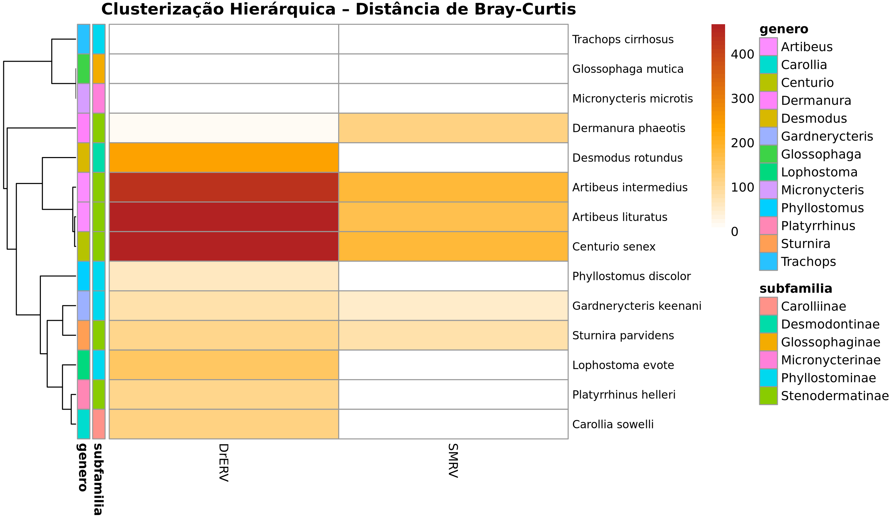

```{r setup, include=FALSE}
knitr::opts_chunk$set(echo = FALSE, warning = FALSE, message = FALSE,
                      fig.align = "center")
library(dplyr)
library(stringr)
library(rentrez)
library(tidyr)
library(vegan)
library(pheatmap)
library(ggplot2)
library(knitr)
library(XML)
library(tibble)
library(gridExtra)

# ── Paleta de cores premium ───────────────────────────────────────────────────
PAL_VIRUS   <- c("DrERV" = "#3B82F6", "SMRV" = "#EF4444")
PAL_GENE    <- c("gag" = "#3B82F6", "pol" = "#10B981", "env" = "#F59E0B", 
                 "complete" = "#EF4444", "ltr" = "#8B5CF6", "unknown" = "#94A3B8")
PAL_SUBFAM  <- c(
  "Stenodermatinae" = "#6366F1", "Phyllostominae" = "#3B82F6",
  "Desmodontinae"   = "#EF4444", "Glossophaginae"  = "#10B981",
  "Micronycterinae" = "#F59E0B", "Carolliinae"     = "#EC4899"
)

# ── Tema premium uniforme para todos os gráficos ─────────────────────────────
theme_betabat <- function(base_size = 10) {
  theme_minimal(base_size = base_size) %+replace%
  theme(
    text             = element_text(family = "sans", color = "#1E293B"),
    plot.title       = element_text(face = "bold", size = base_size + 2,
                                    color = "#0F172A", margin = margin(b=4)),
    plot.subtitle    = element_text(size = base_size - 1, color = "#64748B",
                                    margin = margin(b=8)),
    plot.background  = element_rect(fill = "#FFFFFF", color = NA),
    panel.background = element_rect(fill = "#F8FAFC", color = NA),
    panel.grid.major = element_line(color = "#E2E8F0", linewidth = 0.4),
    panel.grid.minor = element_blank(),
    panel.border     = element_rect(color = "#CBD5E1", fill = NA, linewidth = 0.5),
    axis.title       = element_text(size = base_size - 1, color = "#475569", face = "bold"),
    axis.text        = element_text(size = base_size - 1.5, color = "#64748B"),
    legend.position  = "right",
    legend.background= element_rect(fill = "#F8FAFC", color = "#E2E8F0"),
    legend.title     = element_text(size = base_size - 1, face = "bold"),
    legend.text      = element_text(size = base_size - 2),
    legend.key.size  = unit(0.4, "cm"),
    strip.background = element_rect(fill = "#1E3A5F", color = NA),
    strip.text       = element_text(color = "white", face = "bold", size = base_size - 1),
    plot.margin      = margin(4, 8, 4, 8)
  )
}
```

```{r carregar_dados, include=FALSE}
# ==============================================================================
# PASSO 1: CARREGAR E PREPARAR OS DADOS
# ==============================================================================
data <- read.table("../results/summary_hits.tsv", sep="\t", header = TRUE, stringsAsFactors = FALSE)

data <- data %>% 
  mutate(acesso_limpo = str_extract(sseqid, "[A-Z0-9_]+\\.[0-9]+")) %>%
  mutate(assembly_accession = str_extract(source_file, "GC[AF]_[0-9]+\\.[0-9]+")) %>%
  mutate(virus = case_when(
    str_detect(tolower(source_file), "derv") ~ "DrERV",
    str_detect(tolower(source_file), "smrv") ~ "SMRV",
    TRUE ~ "Outro"
  )) %>%
  mutate(gene = str_extract(tolower(source_file), "(gag|pol|env|complete|ltr)")) %>%
  mutate(gene = replace_na(gene, "unknown")) %>%
  mutate(virus_gene = paste(virus, gene, sep="_")) %>%
  filter(virus != "Outro")

# ==============================================================================
# PASSO 2: TAXONOMIA (banco local instantâneo)
# ==============================================================================
ncbi_all <- read.delim("../data/metadata/ncbi_dataset.tsv", sep="\t", stringsAsFactors = FALSE)
ncbi_phyllo <- read.delim("../data/metadata/phyllostomidae_ncbi.tsv", sep="\t", stringsAsFactors = FALSE)

metadata_local <- bind_rows(ncbi_all, ncbi_phyllo) %>%
  select(Assembly.Accession, Organism.Name) %>%
  distinct() %>%
  rename(assembly_accession = Assembly.Accession, especie = Organism.Name)

data <- data %>% left_join(metadata_local, by = "assembly_accession")

especies_unicas <- unique(data$especie)
especies_unicas <- especies_unicas[!is.na(especies_unicas) & especies_unicas != ""]

db_local <- data.frame(
  especie = c("Phyllostomus discolor", "Desmodus rotundus", "Trachops cirrhosus", 
              "Artibeus lituratus", "Artibeus intermedius", "Glossophaga mutica", 
              "Gardnerycteris keenani", "Micronycteris microtis", "Platyrrhinus helleri", 
              "Dermanura phaeotis", "Carollia sowelli", "Lophostoma evote", 
              "Sturnira parvidens", "Centurio senex"),
  familia = "Phyllostomidae",
  subfamilia = c("Phyllostominae", "Desmodontinae", "Phyllostominae", 
                 "Stenodermatinae", "Stenodermatinae", "Glossophaginae", 
                 "Phyllostominae", "Micronycterinae", "Stenodermatinae", 
                 "Stenodermatinae", "Carolliinae", "Phyllostominae", 
                 "Stenodermatinae", "Stenodermatinae"),
  stringsAsFactors = FALSE
)

get_taxonomy_levels <- function(sp, retries=3) {
  local_match <- db_local %>% filter(especie == sp)
  if(nrow(local_match) > 0) {
    return(data.frame(especie = sp, familia = local_match$familia[1], 
                      subfamilia = local_match$subfamilia[1], genero = stringr::word(sp, 1)))
  }
  for(i in 1:retries) {
    res <- tryCatch({
      tax_search <- entrez_search(db="taxonomy", term=sp)
      if(tax_search$count > 0) {
        tax_rec <- entrez_fetch(db="taxonomy", id=tax_search$ids[1], rettype="xml", parsed=TRUE)
        xml_data <- XML::xmlParse(tax_rec)
        fam_node <- XML::xpathSApply(xml_data, "//LineageEx/Taxon[Rank='family']/ScientificName", XML::xmlValue)
        subfam_node <- XML::xpathSApply(xml_data, "//LineageEx/Taxon[Rank='subfamily']/ScientificName", XML::xmlValue)
        gen_node <- XML::xpathSApply(xml_data, "//LineageEx/Taxon[Rank='genus']/ScientificName", XML::xmlValue)
        familia <- ifelse(length(fam_node) > 0, fam_node[1], "Nao_Identificada")
        subfamilia <- ifelse(length(subfam_node) > 0, subfam_node[1], "Nao_Identificada")
        genero <- ifelse(length(gen_node) > 0, gen_node[1], stringr::word(sp, 1))
        Sys.sleep(0.35)
        return(data.frame(especie = sp, familia = familia, subfamilia = subfamilia, genero = genero))
      }
      return(data.frame(especie = sp, familia = "Nao_Identificada", subfamilia = "Nao_Identificada", genero = stringr::word(sp, 1)))
    }, error = function(e) { Sys.sleep(1); NULL })
    if(!is.null(res)) return(res)
  }
  return(data.frame(especie = sp, familia = "Falha", subfamilia = "Falha", genero = stringr::word(sp, 1)))
}

lista_taxonomia <- lapply(especies_unicas, get_taxonomy_levels)
df_taxonomia <- bind_rows(lista_taxonomia)

df_final <- data %>%
  filter(!is.na(especie)) %>%
  left_join(df_taxonomia, by = "especie") %>%
  filter(genero != "Falha", familia != "Falha", genero != "Nao_Identificada")

# ==============================================================================
# PASSO 3: MATRIZES E DISTÂNCIAS
# ==============================================================================
matriz_hits <- df_final %>%
  group_by(especie, virus_gene) %>%
  summarise(contagem = n(), .groups = 'drop') %>%
  pivot_wider(names_from = virus_gene, values_from = contagem, values_fill = 0) %>%
  as.data.frame()

row.names(matriz_hits) <- matriz_hits$especie
matriz_hits$especie <- NULL

metadados <- df_final %>%
  select(especie, familia, subfamilia, genero) %>%
  distinct() %>%
  as.data.frame()

row.names(metadados) <- metadados$especie
metadados$especie <- NULL

matriz_hits <- matriz_hits[rownames(metadados), , drop=FALSE]

distancia_bray <- vegdist(matriz_hits, method = "bray")
shannon_div     <- diversity(matriz_hits, index = "shannon")
metadados$shannon <- shannon_div

hits_por_especie <- df_final %>%
  group_by(especie, virus_gene) %>%
  summarise(n = n(), .groups="drop") %>%
  pivot_wider(names_from=virus_gene, values_from=n, values_fill=0)

# Teste de Shapiro-Wilk para todos os alvos
shapiro_list <- lapply(names(hits_por_especie)[-1], function(col) {
  test <- tryCatch(shapiro.test(hits_por_especie[[col]]), error=function(e) NULL)
  if(!is.null(test)) {
    data.frame(
      Variável = col,
      W = round(test$statistic, 4),
      `p-valor` = format.pval(test$p.value, digits=3),
      Distribuição = ifelse(test$p.value > 0.05, "✅ Normal", "❌ Não-Normal"),
      stringsAsFactors=FALSE, check.names=FALSE
    )
  }
})
shapiro_results <- do.call(rbind, shapiro_list)

set.seed(123)
res_sub <- if(length(unique(metadados$subfamilia)) > 1)
              adonis2(distancia_bray ~ subfamilia, data = metadados, permutations = 999) else NULL
res_gen <- if(length(unique(metadados$genero)) > 1)
              adonis2(distancia_bray ~ genero,    data = metadados, permutations = 999) else NULL
```

## Visão Geral | Hits por Vírus e Gênero

```{r visao_geral, fig.width=10, fig.height=3.8, out.width="95%", fig.align='center'}
resumo_especie_gene <- df_final %>%
  group_by(especie, virus, gene) %>%
  summarise(insercoes = n(), .groups="drop")

p1 <- ggplot(resumo_especie_gene, aes(x = reorder(especie, -insercoes), y = insercoes, fill = gene)) +
  geom_bar(stat="identity") +
  facet_grid(~ virus, scales="free_x", space="free_x") +
  scale_fill_manual(values = PAL_GENE) +
  theme_betabat() +
  labs(title = "Inserções por Espécie e Região Genômica", x = "Espécie", y = "N° de Hits", fill = "Gene") +
  theme(axis.text.x = element_text(angle=45, hjust=1, face="italic", size=9),
        strip.text = element_text(size=11, face="bold"))

ggsave("../results/figures/visao_geral.png", plot=p1, width=10, height=4.5, dpi=200)
print(p1)
```

<div style="background:#F8FAFC; border-left:4px solid #10B981; padding:8px 12px; font-size:80%; margin-top:10px;">
**Ponto-Chave:** O DrERV domina esmagadoramente as inserções na maioria das espécies. Essa assimetria levanta questões ecológicas sobre a vulnerabilidade genética dos hospedeiros.
</div>

## Premissa Estatística | Teste de Normalidade (Shapiro-Wilk)

> **Teste de Shapiro-Wilk** (Avalia se os dados seguem uma curva de sino)
> - **H0 (Nula):** Os dados são normais (p > 0.05).
> - **H1 (Alternativa):** Os dados **não** são normais (p ≤ 0.05).
> 
> *Como contagens de inserções virais geram dados assimétricos (excesso de zeros e picos), quase sempre rejeitamos H0. Isso exige o uso de ferramentas não-paramétricas (PERMANOVA).*

<div style="display:flex; gap:20px; align-items:center;">
<div style="flex:1;">
```{r qqplots, fig.width=4.5, fig.height=4, out.width="80%", fig.align='center'}
tot_derv <- rowSums(matriz_hits[, grepl("DrERV", colnames(matriz_hits)), drop=FALSE])
tot_smrv <- rowSums(matriz_hits[, grepl("SMRV", colnames(matriz_hits)), drop=FALSE])

par(mfrow=c(2,1), mar=c(4,4,2,1), mgp=c(2.5, 1, 0), cex=0.85)
hist(tot_derv, breaks=20, main="Histograma: DrERV", col="steelblue", xlab="Nº de Inserções", ylab="Frequência")
legend("topright", legend="DrERV", fill="steelblue", bty="n", cex=0.9)
hist(tot_smrv, breaks=20, main="Histograma: SMRV",  col="firebrick", xlab="Nº de Inserções", ylab="Frequência")
legend("topright", legend="SMRV", fill="firebrick", bty="n", cex=0.9)
par(mfrow=c(1,1))
```
</div>
<div style="flex:1; font-size: 85%;">
```{r tabela_shapiro, results='asis'}
knitr::kable(shapiro_results, format="html", align="c", row.names=FALSE) |> cat()
```
</div>
</div>

<small>**Por que PERMANOVA?** Devido à não-normalidade evidente nos gráficos e confirmada pelo p-valor abaixo de 0.05, técnicas paramétricas (como ANOVA) não podem ser usadas. O **PERMANOVA** resolve isso, pois não assume normalidade e roda sobre distâncias pareadas.</small>

## Perfil Retroviral | Heatmap de Dissimilaridade Bray-Curtis

```{r heatmap_save, include=FALSE}
# Salvar heatmap como PNG com resolução maior para não cortar
png("../results/figures/heatmap_bray_curtis.png", width=1100, height=600, res=110)
pheatmap(
  mat                      = as.matrix(matriz_hits),
  annotation_row           = metadados[,c("subfamilia","genero")],
  cluster_rows             = TRUE,
  clustering_distance_rows = distancia_bray,
  cluster_cols             = FALSE,
  clustering_method        = "complete",
  color                    = colorRampPalette(c("white","orange","firebrick"))(50),
  main                     = "Clusterização Hierárquica – Distância de Bray-Curtis",
  fontsize_row             = 9, fontsize = 10,
  silent                   = TRUE
)
dev.off()
```

```{r heatmap, out.width="50%", fig.align="center"}

```

<div style="background:#F8FAFC; border-left:4px solid #10B981; padding:8px 12px; font-size:80%; margin-top:10px;">
**Ponto-Chave:** Morcegos que agrupam juntos no dendrograma (topo) têm "assinaturas" de inserção parecidas, revelando um forte padrão de parentesco e história de exposição viral em comum.
</div>

## O que é Bray-Curtis? | Distância entre Perfis

<div style="font-size:90%; padding:0 10px;">

A **dissimilaridade de Bray-Curtis** compara a composição quantitativa entre pares de espécies:

$$BC_{ij} = 1 - \frac{2 \sum_{k} \min(n_{ik},\; n_{jk})}{\sum_{k} n_{ik} + \sum_{k} n_{jk}}$$

Onde $n_{ik}$ = contagem do vírus $k$ na espécie $i$. Varia de **0** (idênticas) a **1** (completamente distintas).

</div>

```{r bray_matrix, results='asis'}
bc_round <- round(as.matrix(distancia_bray), 2)
# Abreviar nomes das linhas/colunas para caber no slide
rownames(bc_round) <- colnames(bc_round) <- paste0(
  substr(sapply(strsplit(rownames(bc_round)," "), `[`, 1), 1, 3), ".",
  substr(sapply(strsplit(rownames(bc_round)," "), `[`, 2), 1, 4)
)
knitr::kable(bc_round, format="html") |>
  {\(x) paste0("<div style='font-size:10px; overflow-x:auto;'>", x, "</div>")}() |>
  cat()
```

<small>Pares com valor **próximo de 1** têm perfis retrovirais muito distintos.</small>

## Dispersão DrERV × SMRV | Inserções Totais

```{r scatter, fig.width=8.5, fig.height=4.0, out.width="85%", fig.align='center'}
dados_scatter <- metadados %>%
  rownames_to_column("especie") %>%
  mutate(
    DrERV = rowSums(matriz_hits[especie, grepl("DrERV", colnames(matriz_hits)), drop=FALSE]),
    SMRV  = rowSums(matriz_hits[especie, grepl("SMRV", colnames(matriz_hits)), drop=FALSE])
  )

p_scatter <- ggplot(dados_scatter, aes(x=DrERV, y=SMRV, color=subfamilia, size=DrERV+SMRV)) +
  geom_point(alpha=0.85) +
  geom_text(aes(label=especie), vjust=-1.0, size=2.8,
            show.legend=FALSE, fontface="italic", color="#1E293B") +
  scale_color_manual(values = PAL_SUBFAM) +
  scale_size_continuous(range=c(3,10), guide="none") +
  theme_betabat() +
  labs(
    title    = "Perfil Retroviral por Espécie: DrERV × SMRV",
    subtitle = "Tamanho = total de inserções | Cor = Subfamília",
    x = "N° Inserções Totais (DrERV)", y = "N° Inserções Totais (SMRV)", color = "Subfamília"
  )
print(p_scatter)
```

<div style="background:#F8FAFC; border-left:4px solid #10B981; padding:8px 12px; font-size:80%; margin-top:10px;">
**Ponto-Chave:** Algumas subfamílias (ex: extremo direito) concentram carga quase exclusiva de DrERV. O gráfico ilustra a carga total de retrovírus, ignorando temporariamente a separação por gene.
</div>

## Ordenação NMDS | Variação Multivariada
```{r nmds, fig.width=8.5, fig.height=4.0, out.width="85%", fig.align='center'}
set.seed(123)
# Tentar rodar NMDS, se falhar por falta de dados usar PCA simples
nmds <- tryCatch(metaMDS(matriz_hits, distance="bray", k=2, trymax=50, trace=0), error=function(e) NULL)

if(!is.null(nmds)) {
  dados_var <- data.frame(NMDS1 = nmds$points[,1], NMDS2 = nmds$points[,2]) %>%
    rownames_to_column("especie") %>%
    left_join(metadados %>% rownames_to_column("especie"), by="especie")
  
  p_var <- ggplot(dados_var, aes(x=NMDS1, y=NMDS2, color=subfamilia)) +
    geom_point(size=4, alpha=0.85) +
    geom_text(aes(label=especie), vjust=-1.0, size=2.8,
              show.legend=FALSE, fontface="italic", color="#1E293B") +
    scale_color_manual(values = PAL_SUBFAM) +
    theme_betabat() +
    labs(
      title    = "Ordination NMDS: Perfil Retroviral por Espécie",
      subtitle = paste0("Stress = ", round(nmds$stress, 3), " | Distância: Bray-Curtis"),
      x = "NMDS 1", y = "NMDS 2", color = "Subfamília"
    )
  ggsave("../results/figures/nmds_variacao.png", plot=p_var, width=9, height=4.8, dpi=200)
  print(p_var)
} else {
  cat("Não foi possível calcular o NMDS com os dados atuais.")
}
```

<div style="background:#F8FAFC; border-left:4px solid #10B981; padding:8px 12px; font-size:80%; margin-top:10px;">
**Ponto-Chave:** O NMDS é a "fotografia" do PERMANOVA. Morcegos da mesma subfamília formam "nuvens" no espaço ecológico, indicando que o parentesco dita fortemente quais ERVs a espécie carrega.
</div>

## Premissa | Homogeneidade de Dispersão (betadisper)

```{r betadisper, results='asis'}
# Teste de dispersão multivariada (analógo multivariado do Teste de Levene)
disp_sub <- betadisper(distancia_bray, metadados$subfamilia)
set.seed(123)
perm_disp <- tryCatch(permutest(disp_sub, permutations = 999), error=function(e) NULL)

if(!is.null(perm_disp)) {
  tab_disp <- data.frame(
    Teste = "Dispersão (Subfamília)",
    `pseudo-F` = round(perm_disp$tab$F[1], 3),
    `p-valor` = perm_disp$tab$`Pr(>F)`[1],
    Resultado = ifelse(perm_disp$tab$`Pr(>F)`[1] > 0.05, "✅ Homogênea", "❌ Heterogênea"),
    check.names = FALSE
  )
  knitr::kable(tab_disp, format="html", align="c") |> cat()
}
```

> **Teste de Dispersão Multivariada / Betadisper** (Análogo do Teste de Levene)
> - **H0 (Nula):** A dispersão ("espalhamento" dos pontos) é igual entre os grupos (p > 0.05).
> - **H1 (Alternativa):** A dispersão é heterogênea (p ≤ 0.05).
> 
> *Para confiar totalmente no PERMANOVA, H0 precisa ser verdadeira. Se H1 for verdadeira, um resultado significativo no PERMANOVA pode ter sido causado apenas por uma diferença no espalhamento dos grupos, e não por uma diferença de centroide.*

## PERMANOVA (Subfamília) | A Evolução Antiga Importa?

<div style="background:#F8FAFC; border-left:4px solid #3B82F6; padding:8px 12px; font-size:90%; margin-bottom:10px;">
**Pergunta Biológica:** As grandes linhagens evolutivas de morcegos (Subfamílias) carregam assinaturas de retrovírus fundamentalmente diferentes?
</div>
```{r permanova_sub, results='asis'}
if(!is.null(res_sub)) {
  tab_sub <- data.frame(
    Fator = rownames(res_sub)[1:2],
    GL = res_sub$Df[1:2],
    `Soma dos Quadrados` = round(res_sub$SumOfSqs[1:2], 3),
    R2 = paste0(round(res_sub$R2[1:2] * 100, 1), "%"),
    `pseudo-F` = round(res_sub$F[1:2], 3),
    `p-valor` = res_sub$`Pr(>F)`[1:2],
    check.names = FALSE
  )
  tab_sub[2, c("pseudo-F", "p-valor")] <- NA
  knitr::kable(tab_sub, format="html", align="c") |> cat()
} else {
  cat('<div style="background:#F1F5F9; border-radius:8px; padding:12px; color:#64748B;">Subfamília única – teste não aplicável.</div>')
}
```

> **PERMANOVA (Análise de Variância Multivariada Permutacional)**
> - **H0 (Nula):** Não há diferença na composição de vírus entre os grupos.
> - **H1 (Alternativa):** O perfil retroviral é significativamente diferente (p ≤ 0.05).
> 
> *O **R²** (Variação Explicada) indica a porcentagem da dissimilaridade total que é justificada pelo grupo filogenético do hospedeiro.*

## PERMANOVA (Gênero) | O Parentesco Fino Importa?

<div style="background:#F8FAFC; border-left:4px solid #3B82F6; padding:8px 12px; font-size:90%; margin-bottom:10px;">
**Pergunta Biológica:** Dentro das subfamílias, gêneros de morcegos mais próximos evolutivamente também compartilham perfis virais mais parecidos?
</div>
```{r permanova_gen, results='asis'}
if(!is.null(res_gen)) {
  tab_gen <- data.frame(
    Fator = rownames(res_gen)[1:2],
    GL = res_gen$Df[1:2],
    `Soma dos Quadrados` = round(res_gen$SumOfSqs[1:2], 3),
    R2 = paste0(round(res_gen$R2[1:2] * 100, 1), "%"),
    `pseudo-F` = round(res_gen$F[1:2], 3),
    `p-valor` = res_gen$`Pr(>F)`[1:2],
    check.names = FALSE
  )
  tab_gen[2, c("pseudo-F", "p-valor")] <- NA
  knitr::kable(tab_gen, format="html", align="c") |> cat()
} else {
  cat('<div style="background:#F1F5F9; border-radius:8px; padding:12px; color:#64748B;">Gênero único – teste não aplicável.</div>')
}
```

<small>
**Atenção:** Com n=14 espécies e 13 gêneros, o R² alto é esperado (quase 1 ponto por grupo). A significância (p &lt; 0.05) indica que o **perfil retroviral é uma assinatura gênero-específica**, consistente com co-evolução vírus-hospedeiro ao longo da filogenia de Phyllostomidae.
</small>

> **Hipóteses do PERMANOVA**
> - **H0 (Nula):** Não há diferença na composição de vírus entre os gêneros.
> - **H1 (Alternativa):** O perfil retroviral é significativamente diferente entre os gêneros (p ≤ 0.05).

## Sumário | Conclusões

```{r conclusoes, results='asis'}
p_sw_d  <- format.pval(sw_derv$p.value, digits=2)
p_sw_s  <- format.pval(sw_smrv$p.value, digits=2)
bc_mean <- round(mean(as.matrix(distancia_bray)[lower.tri(as.matrix(distancia_bray))]), 2)

r2_sub <- if(!is.null(res_sub)) round(res_sub$R2[1],2) else NA
p_sub  <- if(!is.null(res_sub)) round(res_sub$`Pr(>F)`[1],3) else NA
r2_gen <- if(!is.null(res_gen)) round(res_gen$R2[1],2) else NA
p_gen  <- if(!is.null(res_gen)) round(res_gen$`Pr(>F)`[1],3) else NA

tab <- data.frame(
  Análise = c(
    "Shapiro-Wilk (DrERV)", "Shapiro-Wilk (SMRV)",
    "Bray-Curtis",
    "PERMANOVA Subfamília", "PERMANOVA Gênero"
  ),
  Valor = c(
    p_sw_d, p_sw_s,
    bc_mean,
    ifelse(is.na(r2_sub), "N/A", paste0("R²=", r2_sub, ", p=", p_sub)),
    ifelse(is.na(r2_gen), "N/A", paste0("R²=", r2_gen, ", p=", p_gen))
  ),
  Interpretação = c(
    "Distribuição não-normal → uso de PERMANOVA",
    "Distribuição não-normal → uso de PERMANOVA",
    "Alta dissimilaridade média entre pares",
    ifelse(!is.na(p_sub) && p_sub<=0.05, "✅ Significativo", "⚠️ Tendência (p > 0.05)"),
    ifelse(!is.na(p_gen)  && p_gen<=0.05,  "✅ Significativo", "⚠️ Tendência (p > 0.05)")
  )
)

knitr::kable(tab, format = "html", col.names = c("Análise", "Valor", "Interpretação"),
             align = c("l","c","l")) |> cat()
```

> **Conclusão:** O perfil de endogenização de Betaretrovírus é **gênero-específico** (p < 0.05, R² ≈99%), consistente com co-evolução vírus-hospedeiro independente por linhagem em *Phyllostomidae*.
